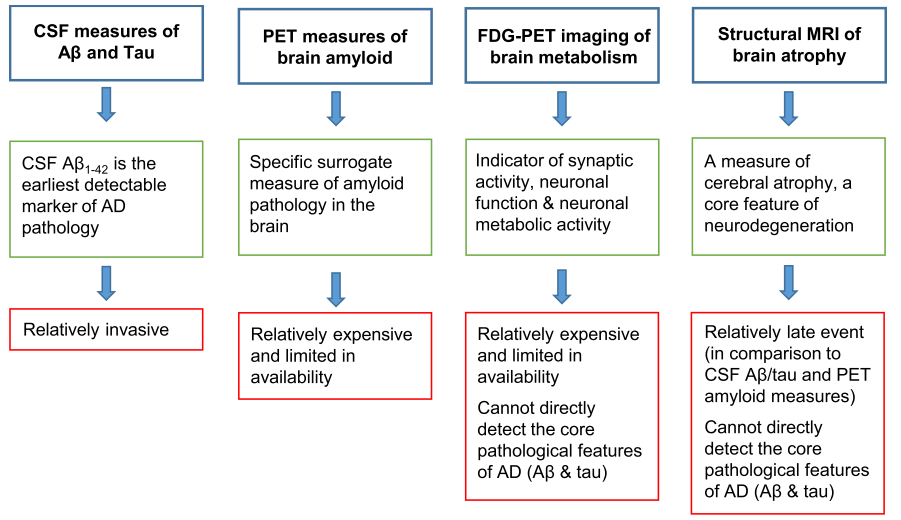
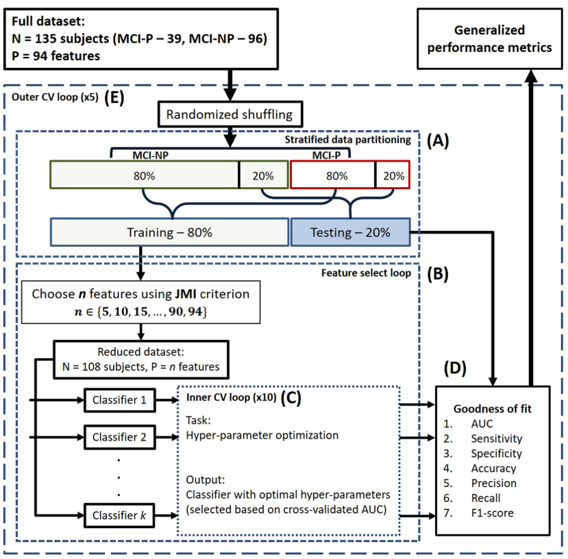
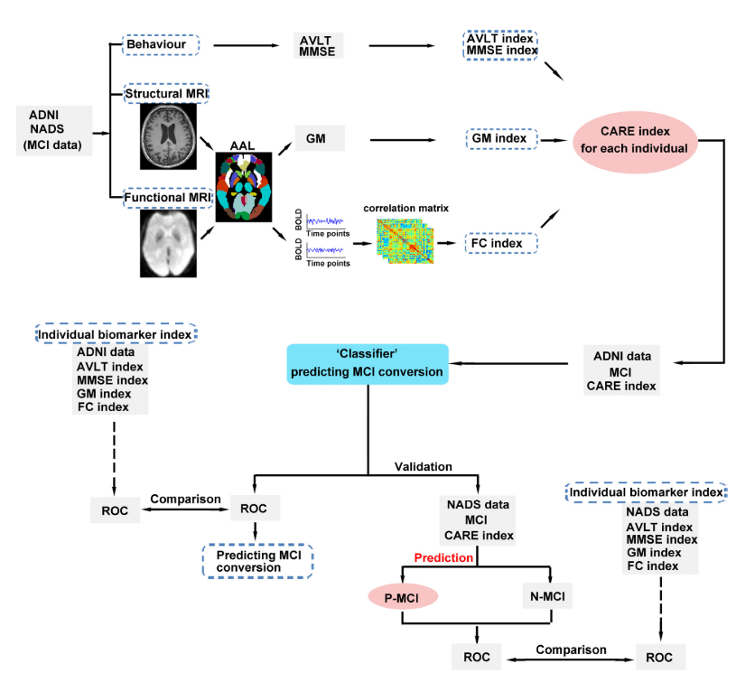
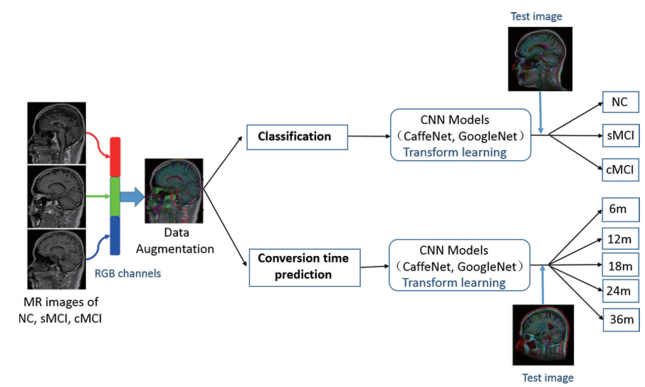
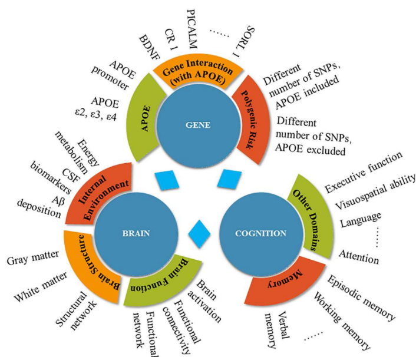
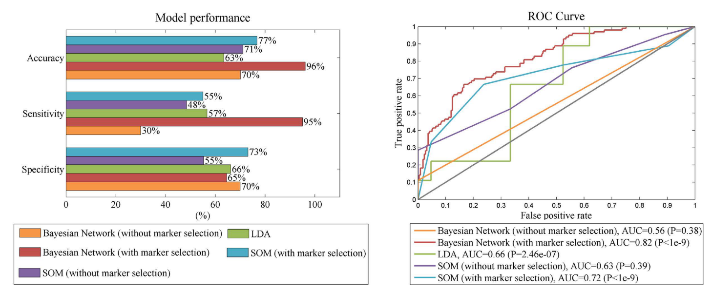

# Mild Cognitive Impairment (MCI) to Alzheimer's Disesase (AD) Risk Prediction, Personal Review 
- 2019-08-11
- Ju Young Ahn
---

## Description
Alzheimers's disease (AD), the most common form of dementia, is characterized by progressive neurodegenerative disorder. 36 million people worldwide are affected by AD and the number is expected to almost triple by 2050. Mild cognitive impairment (MCI) is a precursor phase of Alzheimer's disease. It is important to track MCI patients who will convert to AD. (Haochen, 2016) CSF sample collection (Aβ, total tau (tTau) and phospho-tau (pTau)) is too invasive to be used as a routine clinical examination. Also positron emission tomography (PET) can be expensive and access to scanners and radioligands remains limited. More accessible biomarkers for MCI-to-AD conversion would be needed. 

Advantages (green boxes) and disadvantages (red boxes) of the biomarkers that are currently most widely used in clinical trials. 
   
## Links
- Alzheimer’s Disease Neuroimaging Initiative (ADNI, http://adni.loni.usc.edu/)

## Overall Review Paper on MCI, AD and Biomarkers
1. <a href="http://dx.doi.org/10.1016/j.bcp.2013.12.024">Alzheimer disease: Epidemiology, diagnostic criteria, risk factors and biomarkers (Biochemical Pharmacology, 2014)</a>
2. <a href="https://www.pfmjournal.org/journal/view.php?doi=10.23838/pfm.2018.00065">Neuropsychological test-based risk prediction of conversion to dementia in amnestic mild cognitive impairment patients: a personal view (Precision and Future Medicine,  2018)</a>
  
> Amyloid PET scans are increasingly used in clinical settings, and tracers for tau PET are being developed. Fortunately, our results regarding prediction models demonstrate that decent predictive accuracy can be achieved from readily accessible data. The key to future research in the field of dementia might be the incorporation of advanced techniques into research models as well as ensuring such models are ready and available for use in clinical practice.

3. <a href="https://www.intechopen.com/online-first/precision-medicine-role-of-biomarkers-in-early-prediction-and-diagnosis-of-alzheimer-s-disease">Precision Medicine: Role of Biomarkers in Early Prediction and Diagnosis of Alzheimer’s Disease (IntechOpen, 2018)</a>
4. <a href="https://meddocsonline.org/ebooks/alzheimers-disease-and-treatmen/current-and-novel-biomarkers-for-alzheimers-disease.pdf">Current and Novel Biomarkers for Alzheimer’s disease (MedDocs eBooks, 2018)</a>

## MCI-to-AD Progression risk prediction 

### Multi-modality

| Authors 	| Method 	| Factors 	| Objective 	|
|---------------------------------------------	|---------------------------------------------------	|-------------------------------------------------------------------------------	|---------------------------------------------------------------	|
| <a href="https://www.nature.com/articles/s41598-019-38793-3"> Yogatheesan et al. Scientific Reports, 2019 </a>	| Linear model-based ML framework 	| CSF, MRI, PET, Cognition, Cognitive resilience, Genetic factors, Demographics 	| identifying MCI individuals who progress to AD within 3 years 	</a>|
| <a href="https://www.nature.com/articles/s41598-018-37769-z">Lee et al. Scientific Reports, 2019</a> 	| Recurrent neural network 	| CSF, MRI Cognitive score, Demographics 	| MCI individuals who progress to AD within 6m, 12m, 18m, 24m 	|
| <a href="https://doi.org/10.1371/journal.pone.0138866">Igor O et al. PLOS ONE, 2016 </a>	| Probabilistic multiple kernel learning (pMKL) 	| Clinical Data, MRI, Plasma Proteomic data 	| AD-type dementia during 3-years follow-up or not 	|
| <a href="https://doi.org/10.1016/j.neuroimage.2019.01.031">Simeo et al. Neuroimage, 2019 </a>	| Multi-modality, Multi-tasking Deep Neural Network 	| MRI, Demographics, Neuropsychological, APOe4 genotype 	| pMCI vs. sMCI within 3 years  Healthy vs. AD 	|

1. <a href="https://doi.org/10.1038/s41598-019-38793-3">Predicting short-term MCI-to-AD progression Using Imaging, CsF, Genetic Factors, Cognitive Resilience, and Demographics (Scientific Reports, 2019)</a>

    Method: linear model-based ML framework  
    Factors: 
    - Cerebrospinal fluid (CSF) biomarkers
    - Magnetic resonance imaging biomarkers
    - Positron emission tomography (PET) biomarkers
    - Cognition
    - Cognitive resilience
    - Genetic factors
    - Demographics

    Model Evaluation:  
   ![alt text][image3]
   [image3]: ./figure/20190811_181546.png "Model Evaluation"
2. <a href="https://doi.org/10.1038/s41598-018-37769-z">Predicting Alzheimer’s disease progression using multi-modal deep learning approach (Scientific Reports, 2019)</a>
    
    Method: Deep learning (multimodal recurrent neural network) 
    Data: Alzheimer’s Disease Neuroimaging Initiative (ADNI), Longitudinal, Multimodal (134/561, cMCI vs. sMCI) 
    Factors: 
    - Cerebrospinal fluid (CSF) biomarkers
    - Magnetic resonance imaging biomarkers
    - Cognitive score
    - Demographics

3. <a href="https://doi.org/10.3389/fnins.2018.00260">Combining Polygenic Hazard Score With Volumetric MRI and Cognitive Measures Improves Prediction of Progression From Mild Cognitive Impairment to Alzheimer’s Disease (Front. Neurosci, 2018)</a>

    Method: Survival analyses, Polygenic Hazard Score  
    Data: Alzheimer’s Disease Neuroimaging Initiative (ADNI)  
    Factors: 
    - Polygenic Hazard Score
    - magnetic resonance imaging (MRI)
    - Mini-Mental State Exam (MMSE)
    
    
4. <a href="https://www.ncbi.nlm.nih.gov/pubmed/29843232">A ‘Framingham-like’ algorithm for predicting 4-year risk of progression to amestic mild cognitive impairment or Alzheimer’s disease using multidomain information (J Alzheimers Dis, 2018)</a>

    Method: logistic regression with follow-up time in the model  
    Data: Alzheimer’s Disease Neuroimaging Initiative(ADNI)  
    Classification: 1) Normal -> amnestic mild cognitive impairment (aMCI) / 2) aMCI -> AD  
    Factors (aMCI to AD conversion): 
    - Demographics (age, gender, education, and race)
    - Neuroimaging (brain volume, medial temporal lobe (MTL) volume, and hippocampal volume)
    - CSF biomarkers (AB, p-tau, total tau, and tau/AB ratio)
    - Genetics (family history (first degree relatives), APOE4 status)
    - Memory score (ADAS-Cog, RAVLT, Logical Memory, and MMSE)
    - Functional ability score (Functional Activities Questionnaire (FAQ))
    
    
5. <a href="https://doi.org/10.1371/journal.pone.0113535">A Clinical Index to Predict Progression from Mild Cognitive Impairment to Dementia Due to Alzheimer’s Disease (PLOS ONE, 2014)</a>

    Method: Cox proportional hazards regression (time to AD)  
    Data: Alzheimer’s Disease Neuroimaging Initiative (ADNI)  
    Classification: 3-year risk of progression from mild cognitive impairment to dementia relying  
    Factors: 
    - Demographics (age, sex, race/ethnicity, education, marital status, and family history of AD)
    - Comorbid conditions (hypertension, other cardiovascular disease (e.g., high cholesterol, coronary artery disease), diabetes, respiratory conditions (e.g., asthma, pneumonia), hematopoetic/ lymphatic or malignancy (e.g., anemia, prostate cancer), kidney disease (e.g., kidney stones, renal insufficiency), smoking, head injury, and thyroid conditions (e.g., hypothyroidism, hyperthyroidism))
    - Caregiver report of participant symptoms and function (low energy or insomnia (self-report), abnormal gait (neurologic assessment), blood pressure (normal: diastolic ,90 mmHg and systolic ,140 mmHg; stage 1 hypertension: diastolic 90–99 or systolic 140–159; stage 2 hypertension: diastolic 100 or systolic 160), pulse (beats/minute) and body mass index (BMI, kg/m2))
    - Participant performance on individual items from basic neuropsychological scales 

6. <a href="https://doi.org/10.1371/journal.pone.0138866">Predicting Progression from Mild Cognitive Impairment to Alzheimer's Dementia Using Clinical, MRI, and Plasma Biomarkers via Probabilistic Pattern Classification (PLOS ONE, 2016)</a>

    Method: Probabilistic multiple kernel learning (pMKL) classification (Kernel-based classifier)  
    Data: Alzheimer’s Disease Neuroimaging Initiative (ADNI)  
    > Subjects were then followed longitudinally at specific time points (6, 12, 18, 24, 36 months). The clinical status ofeach MCI subject was re-assessed at each follow-up visit and updated to reflect one ofseveral outcomes (NC, MCI, AD, or other). The N-MCI and P-MCI group designations were based on this follow-up clinical diagnosis and used as the “ground truth” in our classification experiments.
    
    Classification: N-MCI (sMCI) and P-MCI (cMCI)  
    Factors: 
    - Clinical Data
        + risk factors (16 features, age, sex, educa- tion, APOE genotype, family history ofdementia, cerebrovascular disease risk factors, body mass index, and history ofpsychiatric disorders, alcohol abuse, head trauma, and sleep apnea)
        + assessments/markers (170 features, Mini-Mental State Examination, Clinical Dementia Rating scale, Functional Activities Questionnaire, Geriatric Depression Scale, Neuro- psychiatric Inventory Questionnaire, Modified Hachinski Ischemic Scale, American National Adult Reading Test, WMS-III Logical Memory, Alzheimer's Disease Assessment Scale–Cognitive sub-scale, Rey Auditory Verbal Learning Test, verbal (category) fluency test, Boston Nam- ing Test, digit span test, Trail Making Test, Digit-Symbol Coding Test, and Clock-Drawing Test, regimen of AD medications (cholinesterase inhibitors and memantine))
    - Structural MRI Data 
        + 452 region ofinterest (ROI)-based morphometric measures (cortical and subcortical volumes, mean cortical thickness (and its standard deviation), surface area, and curvature...)
    - Plasma Proteomic Data 
    > Plasma-based proteomic biomarkers have been proposed as an alternative for the early diagnosis of AD to cerebrospinal fluid (CSF)-based biomarkers. For these reasons, and because blood plasma samples are arguably less invasive and more routinely obtained than CSF samples, we examined plasma proteomic biomarkers as an alternative to CSF biomarkers.
    
    - amyloid-β proteins (Aβ42, Aβ40, and Aβ42/Aβ40 ratio)
    
    > Aβ42 and Aβ40 have been identified as the major molecular species contributing to the amyloid (“senile”) plaques, a pathological hallmark of AD
    
   Model Evaluation:  
   
   
7. <a href="https://doi.org/10.1186/s13195-017-0301-7">Incremental value of biomarker combinations to predict progression of mild cognitive impairment to Alzheimer’s dementia (Alzheimer's Research & Therapy, 2017)</a>
8. <a href="https://doi.org/10.1016/j.neuroimage.2019.01.031">A parameter-efficient deep learning approach to predict conversion from mild cognitive impairment to Alzheimer's disease (NeuroImage, 2019)</a>
9. <a href="https://www.ncbi.nlm.nih.gov/pubmed/30611311">Erlangen Score as a tool to predict progression from mild cognitive impairment to dementia in Alzheimer’s disease (Alzheimers Res Ther, 2019)</a>
10. <a href="https://www.sciencedirect.com/science/article/pii/S2352872919300077">Predicting time to dementia using a quantitative template of disease progression (Alzheimer's & Dementia, 2019)</a>
11. <a href="https://www.ncbi.nlm.nih.gov/pubmed/31078129">Predicting progression from mild cognitive impairment to Alzheimer’s disease on an individual subject basis by applying the CARE index across different independent cohorts (Aging (Albany NY). 2019)</a>
   

### Medical Image (MRI/PET)
1. <a href="https://www.researchgate.net/publication/328982727_A_Multi-modal_Convolutional_Neural_Network_Framework_for_the_Prediction_of_Alzheimer's_Disease">A Multi-modal Convolutional Neural Network Framework for the Prediction of Alzheimer’s Disease (IEEE Engineering in Medicine and Biology Society, 2018)</a>
1. <a href="https://doi.org/10.3389/fnins.2019.00509">
    Diagnosis of Alzheimer’s Disease via Multi-Modality 3D Convolutional Neural Network (Front. Neurosci, 2018)</a> 
    
    Data: MRI+PET 
1. <a href="https://doi.org/10.1109/icip.2016.7532332">Alzheimer's disease diagnostics by adaptation of 3D convolutional network. (2016)</a>
1. <a href="https://doi.org/10.1007/s12021-018-9370-4">Multi-modality cascaded convolutional neural networks for alzheimer's disease diagnosis. (Neuroinformatics, 2018)</a>
1. <a href="http://dx.doi.org/10.21037/qims.2018.10.17">Discrimination and conversion prediction of MCI using CNN (Quantitative Imaging in Medicine and Surgery, 2018)</a>  

 Deep-learning based conversion prediction  

6. <a href="https://www.ncbi.nlm.nih.gov/pubmed/29632364">Multimodal and Multiscale Deep Neural Networks for the Early Diagnosis of Alzheimer’s Disease using structural MR and FDG-PET images (Scientific Reports, 2017)</a>
7. <a href="https://doi.org/10.1016/j.dadm.2018.07.004">Machine learning of neuroimaging for assisted diagnosis of cognitive impairment and dementia: A systematic review (Neuroimaging, 2018)</a>
8. <a href="https://doi.org/10.1016/j.nicl.2018.101645">Automated classification of Alzheimer's disease and mild cognitive impairment using a single MRI and deep neural networks (NeuroImage: Clinical, 2019)</a>
9. <a href="https://www.sciencedirect.com/science/article/pii/S155252601930086X">A deep learning model for early prediction of Alzheimer’s disease dementia based on hippocampal MRI (Alzheimer's & Dementia, 2019)</a>

### Genetics (APOE4/Polygenic Hazard Score)
1. <a href="https://www.sciencedirect.com/science/article/pii/S1552526015001776?via%3Dihub">  Genetic studies of quantitative MCI and AD phenotypes in ADNI: Progress, opportunities, and plans (Alzheimer's & Dementia, 2015)  </a>

> Genome-wide genotyping was also completed, enabling ADNI data to be included in several large and important GWAS studies.

2. <a href="https://www.ncbi.nlm.nih.gov/pmc/articles/PMC6429136/pdf/ijms-20-01177.pdf">
  The Contribution of Genetic Factors to Cognitive Impairment and Dementia: Apolipoprotein E Gene, Gene Interactions, and Polygenic Risk (Int J Mol Sci. 2019)</a> 

> Evidence from a twin study showed that the heritability for AD was 60–80%. Genome-wide association studies (GWAS) identified susceptibility loci for LOAD, including the apolipoprotein E (APOE) gene, as well as the clusterin (CLU), phosphatidylinositol-binding clathrin assembly protein (PICALM), complement receptor 1 (CR1), bridging integrator 1 (BIN1), sortilin-related receptor L (SORL1), and translocase of outer mitochondrial membrane 40 (TOMM40) genes.  

An overview of the gene, brain, and cognition facets of the current review  

Table: PRS <-> MCI-to-AD conversion / PET tau / CSF 

| Study 	| Participants 	| Study Design 	| SNP 	| APOE 	| Conversion Risk 	| Cognitive Impact 	|
|----------------------------	|-----------------------------------------------------------	|-----------------------------	|-----	|------	|--------------------------------------------------------------------------------------------------------------------------------------------	|-------------------------------------------------------------------------------------------------------------------------------------------------------------------------------------------------------------	|
| <a href="http://www.ncbi.nlm.nih.gov/pubmed/29760643"> Kauppi et al, 2019 </a>	| 336 MCI (baseline age range 55–89) 	| Longitudinal study (3 year) 	| 31 	| Y 	| PGS significantly predicted time to progression from MCI to AD over 120 months, and PGS was significantly more predictive than APOE alone. 	| PGS improved the prediction of change in the CDR-SB score and MMSE over 36 months in MCI at baseline, beyond both APOE and baseline levels of brain atrophy. 	|
| <a href="http://www.ncbi.nlm.nih.gov/pubmed/26976043"> Lacour et al., 2017 </a>	| 4 MCI groups 853/812/1245/306 	| Longitudinal study 	| 9 	| N 	| PGS predicted a small effect on the risk of MCI to AD progression in APOE4 carriers 	| N 	|
|<a href="http://www.ncbi.nlm.nih.gov/pubmed/29177679"> Tan et al, 2018 </a>	| 347 CN, 599 MCI, and 485 in another cohort 	| Longitudinal study 	| 31 	| N 	| N 	| Even after accounting for APOE4 effects, PGS may be useful in MCI and preclinical AD therapeutic trials to enrich for biomarker-positive individuals at highest risk for short-term clinical progression. 	|
| <a href="http://www.ncbi.nlm.nih.gov/pubmed/27834776"> Voyle et al., 2017 </a>	| About 250 people with normal and abnormal CSF A from ADNI 	| Cross-sectional study 	| N 	| N 	| N 	| A case/control PGS is marginally more predictive of A $\beta$ and tau pathology than the basic models (with age, gender and APOE genotype). 	|
| <a href="http://www.ncbi.nlm.nih.gov/pubmed/26921674"> Louwersheimer et al., 2016 </a>	| 1730 MCI 	| Longitudinal study 	| 18 	| N 	| N 	| PGS was modestly associated with cognitive decline over time 	|

3. <a href="https://www.nature.com/articles/s41398-019-0485-7">Alzheimer’s disease polygenic risk score as a predictor of conversion from mild-cognitive impairment
(Translational Psychiatry, 2019)</a>
4. <a href="https://www.frontiersin.org/articles/10.3389/fnagi.2018.00423/full">A Polygenic Risk Score Derived From Episodic Memory Weighted Genetic Variants Is Associated With Cognitive Decline in Preclinical Alzheimer’s Disease (Aging Neurosci, 2018)</a>

### Blood-based (Metabolomics / Proteomics)
1. <a href="https://molecularbrain.biomedcentral.com/articles/10.1186/s13041-019-0448-1">Blood-based molecular biomarkers for Alzheimer’s disease (Molecular Brain, 2019)</a>

  - Targeted blood-based biomarkers
    + Plasma Aβ
    + Plasma tau
    + Plasma neurofilament light
  - Panels of blood-based biomarkers
    + Protein biomarker panels
    + Panels of blood-based biomarker-associated disease phenotypes
    + Metabolomics
    + miRNA biomarker panels
    + Exosomes

2. <a href="https://www.ncbi.nlm.nih.gov/pubmed/31031585">Metabolomics in the Development and Progression of Dementia: A Systematic Review  (Front. Neurosci, 2019)</a>
3. <a href="https://www.researchgate.net/publication/40849834_An_update_on_clinical_proteomics_in_Alzheimer's_research"> An update on clinical proteomics in Alzheimer’s research (J. Neurochem, 2010)</a>
    
4. <a href="http://www.frontiersin.org/Journal/10.3389/fneur.2015.00236/abstract">Blood-Based Proteomic Biomarkers of Alzheimer’s Disease Pathology (Front. Neurol, 2015)</a>

Plasma protein <-> CSF, PET Scan
5. <a href="https://www.ncbi.nlm.nih.gov/pubmed/30618716">Plasma Protein Biomarkers for the Prediction of CSF Amyloid and Tau and [18F]-Flutemetamol PET Scan Result (Front Aging Neurosci, 2018)</a>

Imaging + Plasma protein <-> MCI-to-AD conversion / AD
6. <a href="https://www.nature.com/articles/srep26712">A semi-mechanism approach based on MRI and proteomics for prediction of conversion from mild cognitive impairment to Alzheimer’s disease
(Scientific Reports, 2016)</a>

  Plasma marker used in this study
  - Agouti-Related Protein (AGRP)
  - C-peptide
  - C-Reactive Protein (CRP)
  - Fibroblast Growth Factor 4 (FGF-4)
  - Fibrinogen
  - Insulin (uIU/mL)
  - Matrix Metalloproteinase-10 (MMP-10)
  
The performance of five different conversion prediction models  

